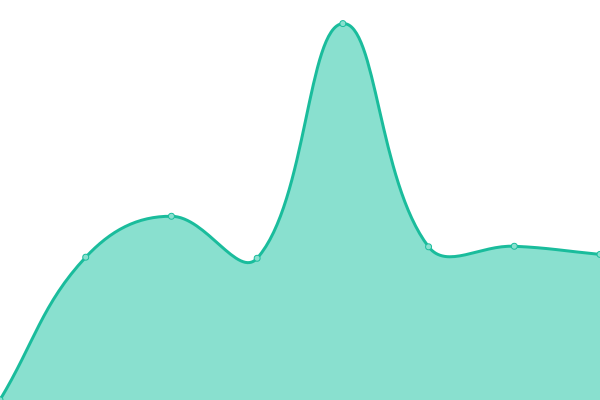
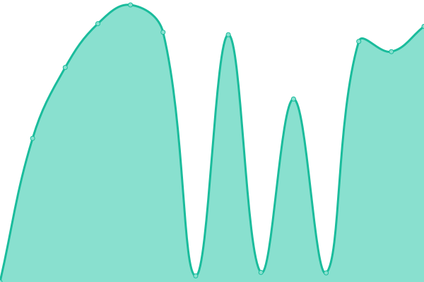

# [📈 Live Status](https://demo.upptime.js.org): <!--live status--> **🟩 All systems operational**

This repository contains the open-source uptime monitor and status page for [Upptime](https://upptime.js.org), powered by [Upptime](https://github.com/upptime/upptime).

With [Upptime](https://upptime.js.org), you can get your own unlimited and free uptime monitor and status page, powered entirely by a GitHub repository. We use [Issues](https://github.com/upptime/upptime/issues) as incident reports, [Actions](https://github.com/ChristmanGit/test-up/actions) as uptime monitors, and [Pages](https://demo.upptime.js.org) for the status page.

<!--start: status pages-->
<!-- This summary is generated by Upptime (https://github.com/upptime/upptime) -->
<!-- Do not edit this manually, your changes will be overwritten -->
<!-- prettier-ignore -->
| URL | Status | History | Response Time | Uptime |
| --- | ------ | ------- | ------------- | ------ |
|  [TribLIVE](https://triblive.com) | 🟩 Up | [trib-live.yml](https://github.com/ChristmanGit/test-up/commits/HEAD/history/trib-live.yml) | 

 422ms
     
 | 

<a href="https://ChristmanGit.github.io/test-up/history/trib-live">100.00%</a>
    

|  [TribTotalMedia](https://tribtotalmedia.com) | 🟩 Up | [trib-total-media.yml](https://github.com/ChristmanGit/test-up/commits/HEAD/history/trib-total-media.yml) | 

 419ms
     
 | 

<a href="https://ChristmanGit.github.io/test-up/history/trib-total-media">100.00%</a>
    

|  [HSSN](https://tribhssn.triblive.com) | 🟩 Up | [hssn.yml](https://github.com/ChristmanGit/test-up/commits/HEAD/history/hssn.yml) | 

 442ms
     
 | 

<a href="https://ChristmanGit.github.io/test-up/history/hssn">100.00%</a>
    

|  [Pennysaver](https://pittsburghpennysaver.com) | 🟩 Up | [pennysaver.yml](https://github.com/ChristmanGit/test-up/commits/HEAD/history/pennysaver.yml) | 

 2766ms
     
 | 

<a href="https://ChristmanGit.github.io/test-up/history/pennysaver">100.00%</a>
    

|  [Best of the Best](https://bestofthebest.triblive.com) | 🟩 Up | [best-of-the-best.yml](https://github.com/ChristmanGit/test-up/commits/HEAD/history/best-of-the-best.yml) | 

 444ms
     
 | 

<a href="https://ChristmanGit.github.io/test-up/history/best-of-the-best">100.00%</a>
    

|  [Print Pittsburgh](https://printpittsburgh.com) | 🟩 Up | [print-pittsburgh.yml](https://github.com/ChristmanGit/test-up/commits/HEAD/history/print-pittsburgh.yml) | 

 477ms
     
 | 

<a href="https://ChristmanGit.github.io/test-up/history/print-pittsburgh">100.00%</a>
    

|  [Heroes TribLIVE](https://heroes.triblive.com) | 🟩 Up | [heroes-trib-live.yml](https://github.com/ChristmanGit/test-up/commits/HEAD/history/heroes-trib-live.yml) | 

 679ms
     
 | 

<a href="https://ChristmanGit.github.io/test-up/history/heroes-trib-live">100.00%</a>
    

|  [Real Estate TribLIVE](https://realestate.triblive.com) | 🟩 Up | [real-estate-trib-live.yml](https://github.com/ChristmanGit/test-up/commits/HEAD/history/real-estate-trib-live.yml) | 

 602ms
     
 | 

<a href="https://ChristmanGit.github.io/test-up/history/real-estate-trib-live">100.00%</a>
    

|  [Mediakit TribLIVE](https://mediakit.triblive.com) | 🟩 Up | [mediakit-trib-live.yml](https://github.com/ChristmanGit/test-up/commits/HEAD/history/mediakit-trib-live.yml) | 

 1459ms
     
 | 

<a href="https://ChristmanGit.github.io/test-up/history/mediakit-trib-live">100.00%</a>
    

<!--end: status pages-->

## 📄 License

- Powered by: [Upptime](https://github.com/upptime/upptime)
- Code: [MIT](./LICENSE) © [Upptime](https://upptime.js.org)
- Data in the `./history` directory: [Open Database License](https://opendatacommons.org/licenses/odbl/1-0/)
